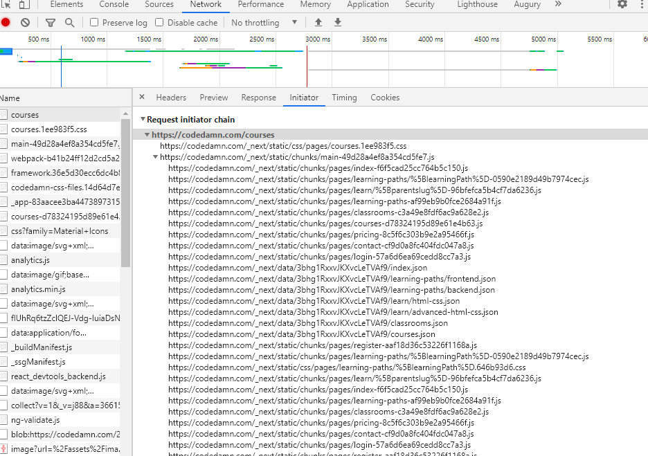

# Networks Tab in Chrome Dev Tool

## Initiator Tab in Networks

- Shows the chain of request.

- At the initial level we make a request.
- from that, we make other requests.

## Filtering Network Request

## Throttling in Network Tab

Slow 3G - means slow loading of the page
Fast 3G - fast loading of the page
